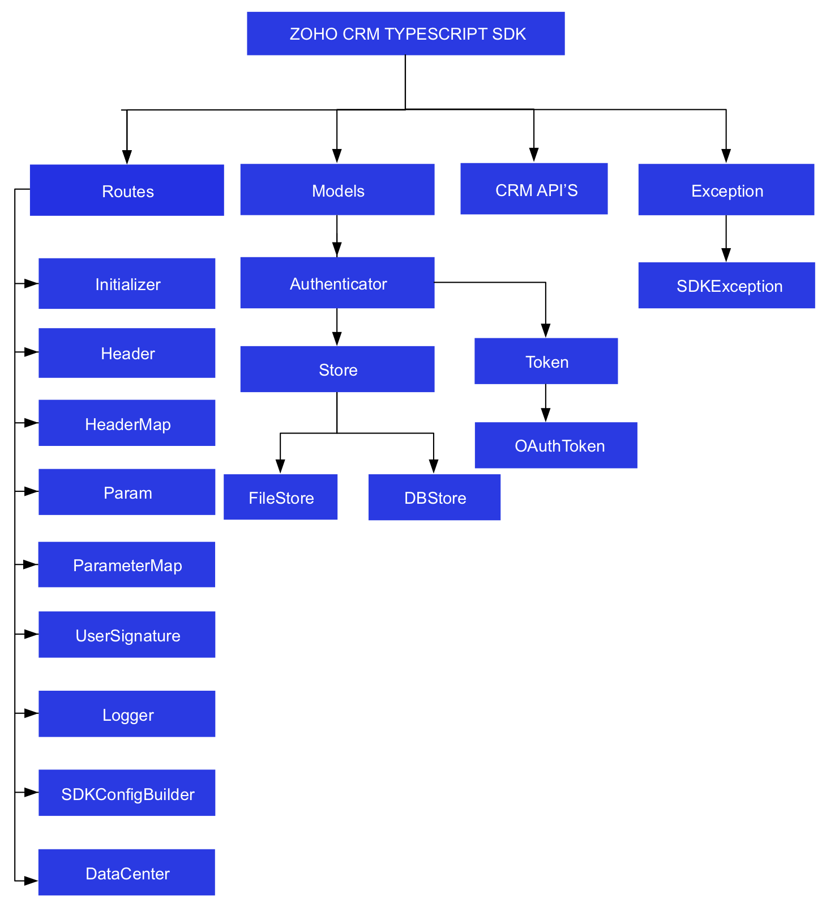

License
=======

    Copyright (c) 2021, ZOHO CORPORATION PRIVATE LIMITED 
    All rights reserved. 

    Licensed under the Apache License, Version 2.0 (the "License"); 
    you may not use this file except in compliance with the License. 
    You may obtain a copy of the License at 
    
        http://www.apache.org/licenses/LICENSE-2.0 
    
    Unless required by applicable law or agreed to in writing, software 
    distributed under the License is distributed on an "AS IS" BASIS, 
    WITHOUT WARRANTIES OR CONDITIONS OF ANY KIND, either express or implied. 
    See the License for the specific language governing permissions and 
    limitations under the License.

# ZOHO CRM TYPESCRIPT SDK for API version 2.1

## Table Of Contents

* [Overview](#overview)
* [Registering a Zoho Client](#registering-a-zoho-client)
* [Environmental Setup](#environmental-setup)
* [Including the SDK in your project](#including-the-sdk-in-your-project)
* [Persistence](#token-persistence)
  * [DataBase Persistence](#database-persistence)
  * [File Persistence](#file-persistence)
  * [Custom Persistence](#custom-persistence)
* [Configuration](#configuration)
* [Initialization](#initializing-the-application)
* [Class Hierarchy](#class-hierarchy)
* [Responses And Exceptions](#responses-and-exceptions)
* [Multi User Support](#multi-user-support-in-the-typescript-sdk)
* [Sample Code](#sdk-sample-code)

## Overview

Zoho CRM TypeScript SDK offers a way to create client TypeScript applications that can be integrated with Zoho CRM.

## Registering a Zoho Client

Since Zoho CRM APIs are authenticated with OAuth2 standards, you should register your client app with Zoho. To register your app:

- Visit this page [https://api-console.zoho.com/](https://api-console.zoho.com)

- Click `ADD CLIENT`.

- Choose the `Client Type`.

- Enter **Client Name**, **Client Domain** or **Homepage URL** and **Authorized Redirect URIs** then click `CREATE`.

- Your Client app will be created.

- Select the created OAuth client.

- Generate grant token by providing the necessary scopes, time duration (the duration for which the generated token is valid) and Scope Description.

## Environmental Setup

TypeScript SDK is installable through **npm**. **npm** is a tool for dependency management in TypeScript. SDK expects the following from the client app:

- Client app must have Node(version 12 and above)

- TypeScript SDK must be installed in the client app through **npm**.

## Including the SDK in your project

- Install **Node** from [nodejs.org](https://nodejs.org/en/download/) (if not installed).

- Install **TypeScript NPM** package.

    ```sh
    npm install -g typescript
    ```

- Install **TypeScript SDK**
    - Navigate to the workspace of your client app.
    - Run the command below:

    ```sh
    npm install @zohocrm/typescript-sdk-2.1
    ```
- The TypeScript SDK will be installed and a package named **@zohocrm/typescript-sdk-2.1** will be created in the local machine.

- Another method to install the SDK:
    - Add dependencies to the package.json of the node server with the latest version (recommended)
    - Run **npm install** in the directory which installs all the dependencies mentioned in package.json.


## Token Persistence

Token persistence refers to storing and utilizing the authentication tokens that are provided by Zoho. There are three ways provided by the SDK in which persistence can be utilized. They are DataBase Persistence, File Persistence and Custom Persistence.

### Table of Contents

- [DataBase Persistence](#database-persistence)

- [File Persistence](#file-persistence)

- [Custom Persistence](#custom-persistence)

### Implementing OAuth Persistence

Once the application is authorized, OAuth access and refresh tokens can be used for subsequent user data requests to Zoho CRM. Hence, they need to be persisted by the client app.

The persistence is achieved by writing an implementation of the inbuilt **TokenStore Class**, which has the following callback methods.

- **getToken(user : UserSignature, token : Token)** - invoked before firing a request to fetch the saved tokens. This method should return implementation **Token Class** object for the library to process it.

- **saveToken(user: UserSignature, token : Token)** - invoked after fetching access and refresh tokens from Zoho.

- **deleteToken(token : Token)** - invoked before saving the latest tokens.

- **getTokens()** - The method to retrieve all the stored tokens.

- **deleteTokens()** - The method to delete all the stored tokens.

- **getTokenById(id, token)** - The method to retrieve the user's token details based on unique ID.

Note:

- **id** is a string.

- **user** is an instance of **UserSignature**.

- **token** is an instance of **Token** interface.

### DataBase Persistence

In case the user prefers to use default DataBase persistence, **MySQL** can be used.

- The database name should be **zohooauth**.

- There must be a table name **oauthtoken** with columns.

  - id varchar(255)

  - user_mail varchar(255)

  - client_id varchar(255)

  - client_secret varchar(255)

  - refresh_token varchar(255)

  - access_token varchar(255)

  - grant_token varchar(255)

  - expiry_time varchar(20)

  - redirect_url varchar(255)

Note:
- Custom database name and table name can be set in DBStore instance.

#### MySQL Query

```sql
CREATE TABLE oauthtoken (
  id varchar(255) NOT NULL,
  user_mail varchar(255) NOT NULL,
  client_id varchar(255),
  client_secret varchar(255),
  refresh_token varchar(255),
  access_token varchar(255),
  grant_token varchar(255),
  expiry_time varchar(20),
  redirect_url varchar(255),
  primary key (id)
);
```

#### Create DBStore object

```ts
import * as ZOHOCRMSDK from "@zohocrm/typescript-sdk-2.1";

/*
* hostName -> DataBase host name. Default value "localhost"
* databaseName -> DataBase name. Default  value "zohooauth"
* userName -> DataBase user name. Default value "root"
* password -> DataBase password. Default value ""
* portNumber -> DataBase port number. Default value "3306"
* tableName -> Table Name. Default value "oauthtoken"
*/

let tokenstore: ZOHOCRMSDK.DBStore = new ZOHOCRMSDK.DBBuilder()
.host("hostName")
.databaseName("databaseName")
.userName("userName")
.portNumber("portNumber")
.tableName("tableName")
.password("password")
.build();
```

### File Persistence

In case of default File Persistence, the user can persist tokens in the local drive, by providing the the absolute file path to the FileStore object.

- The File contains
  
  - id

  - user_mail

  - client_id

  - client_secret

  - refresh_token

  - access_token

  - grant_token

  - expiry_time

  - redirect_url


#### Create FileStore object

```ts
import * as ZOHOCRMSDK from "@zohocrm/typescript-sdk-2.1";
/*
 * FileStore takes the following parameter
 * 1 -> Absolute file path of the file to persist tokens
*/
let tokenstore: ZOHOCRMSDK.FileStore = new ZOHOCRMSDK.FileStore("/Users/username/Documents/ts_sdk_tokens.txt");
```

### Custom Persistence

To use Custom Persistence, you must extend **TokenStore Class** (**ZOHOCRMSDK.TokenStore**) and override the methods.

```ts
import * as ZOHOCRMSDK from "@zohocrm/typescript-sdk-2.1";

export class CustomStore implements ZOHOCRMSDK.TokenStore.MasterModel {
    constructor() {
    }

    /**
     *
     * @param {UserSignature} user A UserSignature class instance.
     * @param {Token} token A Token (@zohocrm/typescript-sdk-2.1/models/authenticator/oauth_token) class instance.
     * @returns A Token class instance representing the user token details.
     * @throws {SDKException} if any error occurs.
     */
    async getToken(user: ZOHOCRMSDK.UserSignature, token: ZOHOCRMSDK.Token.MasterModel): Promise<ZOHOCRMSDK.Token.MasterModel | undefined> {
        // Add code to get the token
        return undefined;
    }

    /**
     *
     * @param {UserSignature} user A UserSignature class instance.
     * @param {Token} token A Token (@zohocrm/typescript-sdk-2.1/models/authenticator/oauth_token) class instance.
     * @throws {SDKException} if any error occurs.
     */
    async saveToken(user: ZOHOCRMSDK.UserSignature, token: ZOHOCRMSDK.Token.MasterModel): Promise<void>{
        // Add code to save the token
    }

    /**
     *
     * @param {Token} token A Token (@zohocrm/typescript-sdk-2.1/models/authenticator/oauth_token) class instance.
     * @throws {SDKException} if any error occurs.
     */
    async deleteToken(token: ZOHOCRMSDK.Token.MasterModel): Promise<void> {
        // Add code to delete the token
    }

    /**
     * @returns {Array} - An array of Token class instances
     * @throws {SDKException}
     */
    async getTokens(): Promise<Array<ZOHOCRMSDK.Token.MasterModel> | undefined> {
        //Add code to retrieve all the stored tokens.
    }

    /**
     * @throws {SDKException}
     */
    deleteTokens(): void {
        //Add code to delete all the stored tokens.
    }

    /**
     * This method is used to retrieve the user token details based on unique ID
     * @param {String} id - A String representing the unique ID
     * @param {Token} token - A Token class instance.
     * @return {Token} A Token class instance representing the user token details.
     * @throws SDKException
     */
    getTokenById(id: string, token: ZOHOCRMSDK.Token.MasterModel): Promise<ZOHOCRMSDK.Token.MasterModel | undefined> {
      // Add code to get the token using unique id
    }
}
```

## Configuration

Before you get started with creating your TypeScript application, you need to register your client and authenticate the app with Zoho.

| Mandatory Keys    | Optional Keys |
| :---------------- | :------------ |
| user              | logger        |
| environment       | tokenstore    |
| token             | sdkConfig     |
|                   | requestProxy  |
|                   | resourcePath  |
-----

- Create an instance of **ZOHOCRMSDK.UserSignature** Class that identifies the current user.
    ```ts
    import * as ZOHOCRMSDK from "@zohocrm/typescript-sdk-2.1";
    //Create an UserSignature instance that takes user Email as parameter
    let user: ZOHOCRMSDK.UserSignature = new ZOHOCRMSDK.UserSignature("abc@zoho.com");
    ```

- Configure API environment which decides the domain and the URL to make API calls.
    ```ts
    import * as ZOHOCRMSDK from "@zohocrm/typescript-sdk-2.1";
    /*
     * Configure the environment
     * which is of the pattern Domain.Environment
     * Available Domains: USDataCenter, EUDataCenter, INDataCenter, CNDataCenter, AUDataCenter, JPDataCenter
     * Available Environments: PRODUCTION(), DEVELOPER(), SANDBOX()
    */
    let environment: Environment = ZOHOCRMSDK.USDataCenter.PRODUCTION();
    ```

- Create an instance of **ZOHOCRMSDK.OAuthToken** with the information that you get after registering your Zoho client.
    ```ts
    import * as ZOHOCRMSDK from "@zohocrm/typescript-sdk-2.1";
    /*
    * Create a Token instance that requires the following
    * clientId -> OAuth client id.
    * clientSecret -> OAuth client secret.
    * refreshToken -> REFRESH token.
    * accessToken -> Access token.
    * grantToken -> GRANT token.
    * id -> User unique id.
    * redirectURL -> OAuth redirect URL.
    */
    //Create a Token instance
    // if refresh token is available
    // The SDK throws an exception, if the given id is invalid.
    let token: ZOHOCRMSDK.OAuthToken = new ZOHOCRMSDK.OAuthBuilder()
    .id("id")
    .build();

    // if grant token is available
    let token: ZOHOCRMSDK.OAuthToken = new ZOHOCRMSDK.OAuthBuilder()
    .clientId("clientId")
    .clientSecret("clientSecret")
    .grantToken("grantToken")
    .redirectURL("redirectURL")
    .build();
    
    // if ID (obtained from persistence) is available
    let token: ZOHOCRMSDK.OAuthToken = new ZOHOCRMSDK.OAuthBuilder()
    .clientId("clientId")
    .clientSecret("clientSecret")
    .refreshToken("refreshToken")
    .redirectURL("redirectURL")
    .build();

    // if access token is available
    let token: ZOHOCRMSDK.OAuthToken = new ZOHOCRMSDK.OAuthBuilder()
    .accessToken("accessToken")
    .build();
    ```
- Create an instance of **ZOHOCRMSDK.Logger** Class to log exception and API information. By default, the SDK constructs a Logger instance with level - INFO and file_path - (sdk_logs.log parallel to node_modules)
    ```ts
    import * as ZOHOCRMSDK from "@zohocrm/typescript-sdk-2.1";
    /*
    * Create an instance of Logger Class that takes two parameters
    * level -> Level of the log messages to be logged. Can be configured by typing Levels "." and choose any level from the list displayed.
    * filePath -> Absolute file path, where messages need to be logged.
    */
    let logger: ZOHOCRMSDK.Logger = new ZOHOCRMSDK.LogBuilder()
    .level(ZOHOCRMSDK.Levels.INFO)
    .filePath("/Users/user_name/Documents/node_sdk_logs.log")
    .build();
    ```

- Create an instance of TokenStore to persist tokens, used for authenticating all the requests. By default, the SDK creates the sdk_tokens.txt file (parallel to node_modules folder) to persist the tokens.
    ```ts
    import * as ZOHOCRMSDK from "@zohocrm/typescript-sdk-2.1";
    
    /*
    * hostName -> DataBase host name. Default value "localhost"
    * databaseName -> DataBase name. Default  value "zohooauth"
    * userName -> DataBase user name. Default value "root"
    * password -> DataBase password. Default value ""
    * portNumber -> DataBase port number. Default value "3306"
    * tableName -> Table Name. Default value "oauthtoken"
    */
    let tokenstore: ZOHOCRMSDK.DBStore = new ZOHOCRMSDK.DBBuilder().build();

    let tokenstore: ZOHOCRMSDK.DBStore = new ZOHOCRMSDK.DBBuilder()
    .host("hostName")
    .databaseName("databaseName")
    .userName("userName")
    .portNumber("portNumber")
    .tableName("tableName")
    .password("password")
    .build();

    //let tokenstore: FileStore = new FileStore("/Users/userName/tssdk-tokens.txt")
    ```

- Create an instance of **ZOHOCRMSDK.SDKConfig** containing the SDK configuration.
    ```ts
    import * as ZOHOCRMSDK from "@zohocrm/typescript-sdk-2.1";
    /*
     * By default, the SDK creates the SDKConfig instance
     * autoRefreshFields (default - false)
     * if true - all the modules' fields will be auto-refreshed in the background, every hour.
     * if false - the fields will not be auto-refreshed in the background. The user can manually delete the file(s) or refresh the fields using methods from ModuleFieldsHandler(utils/util/module_fields_handler.ts)
     *
     * pickListValidation (default - true)
     * A boolean field that validates user input for a pick list field and allows or disallows the addition of a new value to the list.
     * if true - the SDK validates the input. If the value does not exist in the pick list, the SDK throws an error.
     * if false - the SDK does not validate the input and makes the API request with the user’s input to the pick list
     */
    let sdkConfig: ZOHOCRMSDK.SDKConfig = new ZOHOCRMSDK.SDKConfigBuilder().pickListValidation(false).autoRefreshFields(true).build();
    ```

- Create an instance of **ZOHOCRMSDK.RequestProxy** containing the proxy properties of the user.
    ```ts
   import * as ZOHOCRMSDK from "@zohocrm/typescript-sdk-2.1";
    /*
     * RequestProxy class takes the following parameters
     * host -> Host
     * port -> Port Number
     * user -> User Name. Default null.
     * password -> Password. Default null
     */
    let requestProxy: ZOHOCRMSDK.RequestProxy = new ZOHOCRMSDK.ProxyBuilder()
    .host("proxyHost")
    .port("proxyPort")
    .user("proxyUser")
    .password("password")
    .build();
    ```

- The path containing the absolute directory path to store user specific files containing module fields information. By default, the SDK stores the user-specific files in a folder parallel to node_modules
    ```ts
    let resourcePath: string = "/Users/user_name/Documents/typescript-app";
    ```

## Initializing the Application

Initialize the SDK using the following code.

```ts
    import * as ZOHOCRMSDK from "@zohocrm/typescript-sdk-2.1";

    export class Initializer {
        public static async initialize() {
            /*
            * Create an instance of Logger Class that takes two parameters
            * level -> Level of the log messages to be logged. Can be configured by typing Levels "." and choose any level from the list displayed.
            * filePath -> Absolute file path, where messages need to be logged.
            */
            let logger: ZOHOCRMSDK.Logger = new ZOHOCRMSDK.LogBuilder()
            .level(ZOHOCRMSDK.Levels.INFO)
            .filePath("/Users/user_name/Documents/ts_sdk_log.log")
            .build();

            /*
            * Create an UserSignature instance that takes user Email as parameter
            */
            let user: ZOHOCRMSDK.UserSignature = new ZOHOCRMSDK.UserSignature("abc@zoho.com");

            /*
            * Configure the environment
            * which is of the pattern Domain.Environment
            * Available Domains: USDataCenter, EUDataCenter, INDataCenter, CNDataCenter, AUDataCenter, JPDataCenter
            * Available Environments: PRODUCTION(), DEVELOPER(), SANDBOX()
            */
            let environment: ZOHOCRMSDK.Environment = ZOHOCRMSDK.USDataCenter.PRODUCTION();

           /*
            * Create a Token instance that requires the following
            * clientId -> OAuth client id.
            * clientSecret -> OAuth client secret.
            * refreshToken -> REFRESH token.
            * grantToken -> GRANT token.
            * id -> User unique id.
            * redirectURL -> OAuth redirect URL.
            */
            // if ID (obtained from persistence) is available
            let token: ZOHOCRMSDK.OAuthToken = new ZOHOCRMSDK.OAuthBuilder()
            .clientId("clientId")
            .clientSecret("clientSecret")
            .refreshToken("refreshToken")
            .redirectURL("redirectURL")
            .build();

            /*
            * hostName -> DataBase host name. Default value "localhost"
            * databaseName -> DataBase name. Default  value "zohooauth"
            * userName -> DataBase user name. Default value "root"
            * password -> DataBase password. Default value ""
            * portNumber -> DataBase port number. Default value "3306"
            * tableName -> Table Name. Default value "oauthtoken"
            */
            let tokenstore: ZOHOCRMSDK.DBStore = new ZOHOCRMSDK.OAuthBuilder()
            .host("hostName")
            .databaseName("databaseName")
            .userName("userName")
            .portNumber("portNumber")
            .tableName("tableName")
            .password("password")
            .build();

            /*
            * Create an instance of FileStore that takes absolute file path as parameter
            */
            // let store: ZOHOCRMSDK.FileStore = new ZOHOCRMSDK.FileStore("/Users/userName/ts_sdk_tokens.txt");

            /*
            * autoRefreshFields
            * if true - all the modules' fields will be auto-refreshed in the background, every hour.
            * if false - the fields will not be auto-refreshed in the background. The user can manually delete the file(s) or refresh the fields using methods from ModuleFieldsHandler(utils/util/module_fields_handler.js)
            * 
            * pickListValidation
            * A boolean field that validates user input for a pick list field and allows or disallows the addition of a new value to the list.
            * if true - the SDK validates the input. If the value does not exist in the pick list, the SDK throws an error.
            * if false - the SDK does not validate the input and makes the API request with the user’s input to the pick list
            */
            let sdkConfig: ZOHOCRMSDK.SDKConfig = new ZOHOCRMSDK.SDKConfigBuilder().pickListValidation(false).autoRefreshFields(true).build();

            /*
            * The path containing the absolute directory path to store user specific JSON files containing module fields information.
            */
            let resourcePath: string = "/Users/user_name/tsssdk-application";

            /*
            * RequestProxy class takes the following parameters
            * host -> Host
            * port -> Port Number
            * user -> User Name. Default null.
            * password -> Password. Default null
            */
            let requestProxy: ZOHOCRMSDK.RequestProxy = new ZOHOCRMSDK.ProxyBuilder()
            .host("proxyHost")
            .port("proxyPort")
            .user("proxyUser")
            .password("password")
            .build();

           /*
            * Call the static initialize method of Initializer class that takes the following arguments
            * user -> UserSignature instance
            * environment -> Environment instance
            * token -> Token instance
            * store -> TokenStore instance
            * SDKConfig -> SDKConfig instance
            * resourcePath -> resourcePath
            * logger -> Logger instance
            */
            try {
                (await new ZOHOCRMSDK.InitializeBuilder())
                    .user(user)
                    .environment(environment)
                    .token(token)
                    .store(tokenstore)
                    .SDKConfig(sdkConfig)
                    .resourcePath(resourcePath)
                    .logger(logger)
                    .initialize();
            } catch (error) {
                console.log(error);
            }

        }
    }

    Initializer.initialize()
```

- You can now access the functionalities of the SDK. Refer to the sample codes to make various API calls through the SDK.

## Class Hierarchy



## Responses and Exceptions

All SDK method calls return an instance of **[ZOHOCRMSDK.APIResponse](routes/controllers/api_response.ts)**.

After a successful API request, the **getObject()** method returns an instance of the ResponseWrapper (for **GET**) or the ActionWrapper (for **POST, PUT, DELETE**).

Whenever the API returns an error response, the **getObject()** returns an instance of **APIException** class.

**ResponseWrapper** (for **GET** requests) and ActionWrapper (for **POST, PUT, DELETE** requests) are the expected objects for Zoho CRM APIs’ responses

However, some specific operations have different expected objects, such as the following

- Operations involving records in Tags
    - **RecordActionWrapper**

- Getting Record Count for a specific Tag operation
    - **CountWrapper**

- Operations involving BaseCurrency
    - **BaseCurrencyActionWrapper**

- Lead convert operation
    - **ConvertActionWrapper**

- Retrieving Deleted records operation
    - **DeletedRecordsWrapper**

- Record image download operation
    - **FileBodyWrapper**

- MassUpdate record operations
    - **MassUpdateActionWrapper**
    - **MassUpdateResponseWrapper**

### GET Requests

- The **getObject()** returns instance of one of the following classes, based on the return type.
    - For  **application/json** responses
        - **ResponseWrapper**
        - **CountWrapper**
        - **DeletedRecordsWrapper**
        - **MassUpdateResponseWrapper**
        - **APIException**

    - For **file download** responses
        - **FileBodyWrapper**
        - **APIException**

### POST, PUT, DELETE Requests

- The **getObject()** returns instance of one of the following classes
    - **ActionWrapper**
    - **RecordActionWrapper**
    - **BaseCurrencyActionWrapper**
    - **MassUpdateActionWrapper**
    - **ConvertActionWrapper**
    - **APIException**

- These wrapper classes may contain one or an array of instances of the following classes, depending on the response
    - **SuccessResponse Class**, if the request was successful.
    - **APIException Class**, if the request was erroneous.

For example, when you insert two records, and one of them was inserted successfully while the other one failed, the ActionWrapper will contain one instance each of the SuccessResponse and APIException classes.

All other exceptions such as SDK anomalies and other unexpected behaviours are thrown under the **SDKException** class.

## Multi-User support in the TypeScript SDK

The **TypeScript SDK** (from version 1.x.x) supports both single-user and multi-user app.

### Multi-user App

Multi-users functionality is achieved using Initializer's static **switchUser()** method.

```ts
(await new ZOHOCRMSDK.InitializeBuilder())
    .user(user)
    .environment(environment)
    .token(token)
    .SDKConfig(sdkConfig)
    .switchUser();
```

To Remove a user's configuration in SDK. Use the below code
```js
await ZOHOCRMSDK.Initializer.removeUserConfiguration(user, environment)
```

### Sample Multi-user code

```ts
    import * as ZOHOCRMSDK from "@zohocrm/typescript-sdk-2.1";
    class SampleRecord {
        public static async call() {
           /*
            * Create an instance of Logger Class that takes two parameters
            * level -> Level of the log messages to be logged. Can be configured by typing Levels "." and choose any level from the list displayed.
            * filePath -> Absolute file path, where messages need to be logged.
            */
            let logger: ZOHOCRMSDK.Logger = new ZOHOCRMSDK.LogBuilder()
            .level(ZOHOCRMSDK.Levels.INFO)
            .filePath("/Users/user_name/Documents/ts_sdk_log.log")
            .build();

            /*
            * Create an UserSignature instance that takes user Email as parameter
            */
            let user: ZOHOCRMSDK.UserSignature = new ZOHOCRMSDK.UserSignature("abc@zoho.com");

            /*
            * Configure the environment
            * which is of the pattern Domain.Environment
            * Available Domains: USDataCenter, EUDataCenter, INDataCenter, CNDataCenter, AUDataCenter, JPDataCenter
            * Available Environments: PRODUCTION(), DEVELOPER(), SANDBOX()
            */
            let environment: ZOHOCRMSDK.Environment = ZOHOCRMSDK.USDataCenter.PRODUCTION();

            /*
            * Create a Token instance
            * clientId -> OAuth client id.
            * clientSecret -> OAuth client secret.
            * grantToken -> OAuth Grant Token. 
            * refreshToken -> OAuth Refresh Token token.
            * redirectURL -> OAuth Redirect URL.
            */
            let token: ZOHOCRMSDK.OAuthToken = new ZOHOCRMSDK.OAuthBuilder()
            .clientId("clientId")
            .clientSecret("clientSecret")
            .refreshToken("refreshToken")
            .redirectURL("redirectURL")
            .build();

            /*
            * Create an instance of TokenStore.
            * host -> DataBase host name. Default "localhost"
            * databaseName -> DataBase name. Default "zohooauth"
            * userName -> DataBase user name. Default "root"
            * password -> DataBase password. Default ""
            * portNumber -> DataBase port number. Default "3306"
            * tableName -> DataBase table name. Default "oauthtoken"
            */
            let tokenstore: ZOHOCRMSDK.DBStore = new ZOHOCRMSDK.OAuthBuilder()
            // .host("hostName")
            // .databaseName("databaseName")
            // .userName("userName")
            // .portNumber("portNumber")
            // .tableName("tableName")
            // .password("password")
            // .build();

            /*
            * Create an instance of FileStore that takes absolute file path as parameter
            */
            let store: ZOHOCRMSDK.FileStore = new ZOHOCRMSDK.FileStore("/Users/username/ts_sdk_tokens.txt");

            /*
            * autoRefreshFields
            * if true - all the modules' fields will be auto-refreshed in the background, every    hour.
            * if false - the fields will not be auto-refreshed in the background. The user can manually delete the file(s) or refresh the fields using methods from ModuleFieldsHandler(utils/util/module_fields_handler.ts)
            *
            * pickListValidation
            * A boolean field that validates user input for a pick list field and allows or disallows the addition of a new value to the list.
            * True - the SDK validates the input. If the value does not exist in the pick list, the SDK throws an error.
            * False - the SDK does not validate the input and makes the API request with the user’s input to the pick list
            */
            let sdkConfig: ZOHOCRMSDK.SDKConfig = new ZOHOCRMSDK.SDKConfigBuilder().pickListValidation(false).autoRefreshFields(true).build();

            /*
            * The path containing the absolute directory path to store user specific JSON files containing module fields information.
            */
            let resourcePath: string = "/Users/user_name/Documents/ts-app";

            /*
            * Call the static initialize method of Initializer class that takes the following arguments
            * user -> UserSignature instance
            * environment -> Environment instance
            * token -> Token instance
            * store -> TokenStore instance
            * SDKConfig -> SDKConfig instance
            * resourcePath -> resourcePath
            * logger -> Logger instance
            */
            try {
                (await new ZOHOCRMSDK.InitializeBuilder())
                    .user(user1)
                    .environment(environment1)
                    .token(token1)
                    .store(store)
                    .SDKConfig(sdkConfig)
                    .resourcePath(resourcePath)
                    .logger(logger)
                    .initialize();
            } catch (error) {
                console.log(error);
            }

            await SampleRecord.getRecords("Leads");

            await ZOHOCRMSDK.Initializer.removeUserConfiguration(user1, environment1);

            let user2: ZOHOCRMSDK.UserSignature = new ZOHOCRMSDK.UserSignature("abc2@zoho.eu");

            let environment2: ZOHOCRMSDK.Environment = ZOHOCRMSDK.EUDataCenter.SANDBOX();

            let token2: ZOHOCRMSDK.OAuthToken= = new ZOHOCRMSDK.OAuthBuilder()
            .clientId("clientId")
            .clientSecret("clientSecret")
            .refreshToken("refreshToken")
            .redirectURL("redirectURL")
            .build();

            let sdkConfig2: ZOHOCRMSDK.SDKConfig = new ZOHOCRMSDK.SDKConfigBuilder().pickListValidation(true).autoRefreshFields(true).build();

            (await new ZOHOCRMSDK.InitializeBuilder())
            .user(user2)
            .environment(environment2)
            .token(token2)
            .SDKConfig(sdkConfig2)
            .switchUser();

            await SampleRecord.getRecords("Leads");
        }

        static async getRecords(moduleAPIName: string) {
            try {
                let moduleAPIName = "Leads";
                //Get instance of RecordOperations Class
                let recordOperations: ZOHOCRMSDK.Records.RecordOperations = new ZOHOCRMSDK.Records.RecordOperations();
                let paramInstance: ZOHOCRMSDK.ParameterMap = new ZOHOCRMSDK.ParameterMap();
                await paramInstance.add(ZOHOCRMSDK.Records.GetRecordsParam.APPROVED, "both");
                let headerInstance: ZOHOCRMSDK.HeaderMap  = new ZOHOCRMSDK.HeaderMap();
                await headerInstance.add(ZOHOCRMSDK.Records.GetRecordsHeader.IF_MODIFIED_SINCE, new Date("2020-01-01T00:00:00+05:30"));
                //Call getRecords method that takes paramInstance, headerInstance and moduleAPIName as parameters
                let response: ZOHOCRMSDK.APIResponse<ZOHOCRMSDK.Records.ResponseHandler.MasterModel> = await recordOperations.getRecords(moduleAPIName, paramInstance, headerInstance);
                if(response != null){
                    //Get the status code from response
                    console.log("Status Code: " + response.getStatusCode());
                    if([204, 304].includes(response.getStatusCode())){
                        console.log(response.getStatusCode() == 204? "No Content" : "Not Modified");
                        return;
                    }
                    //Get the object from response
                    let responseObject: ZOHOCRMSDK.Records.ResponseHandler.MasterModel = response.getObject();
                    if(responseObject != null){
                        //Check if expected ResponseWrapper instance is received
                        if(responseObject instanceof ZOHOCRMSDK.Records.ResponseWrapper){
                            //Get the array of obtained Record instances
                            let records: ZOHOCRMSDK.Records.Record[] = responseObject.getData();
                            for (let record of records) {
                                //Get the ID of each Record
                                console.log("Record ID: " + record.getId());
                                //Get the createdBy User instance of each Record
                                let createdBy = record.getCreatedBy();
                                //Check if createdBy is not null
                                if(createdBy != null)
                                {
                                    //Get the ID of the createdBy User
                                    console.log("Record Created By User-ID: " + createdBy.getId());
                                    //Get the name of the createdBy User
                                    console.log("Record Created By User-Name: " + createdBy.getName());
                                    //Get the Email of the createdBy User
                                    console.log("Record Created By User-Email: " + createdBy.getEmail());
                                }
                                //Get the CreatedTime of each Record
                                console.log("Record CreatedTime: " + record.getCreatedTime());
                                //Get the modifiedBy User instance of each Record
                                let modifiedBy = record.getModifiedBy();
                                //Check if modifiedBy is not null
                                if(modifiedBy != null){
                                    //Get the ID of the modifiedBy User
                                    console.log("Record Modified By User-ID: " + modifiedBy.getId());
                                    //Get the name of the modifiedBy User
                                    console.log("Record Modified By User-Name: " + modifiedBy.getName());
                                    //Get the Email of the modifiedBy User
                                    console.log("Record Modified By User-Email: " + modifiedBy.getEmail());
                                }
                                //Get the ModifiedTime of each Record
                                console.log("Record ModifiedTime: " + record.getModifiedTime());
                                //Get the list of Tag instance each Record
                                let tags: ZOHOCRMSDK.Tags.Tag[] = record.getTag();
                                //Check if tags is not null
                                if(tags != null){
                                    tags.forEach(tag => {
                                        //Get the Name of each Tag
                                        console.log("Record Tag Name: " + tag.getName());
                                        //Get the Id of each Tag
                                        console.log("Record Tag ID: " + tag.getId());
                                    });
                                }
                                //To get particular field value
                                console.log("Record Field Value: " + record.getKeyValue("Last_Name"));// FieldApiName

                                console.log("Record KeyValues: " );
                                let keyValues: Map<string,any> = record.getKeyValues();
                                let keyArray: string[] = Array.from(keyValues.keys());
                                for (let keyName of keyArray) {
                                    let value: any = keyValues.get(keyName);
                                    console.log(keyName + " : " + value);
                                }
                            }
                        }
                    }
                }
            } catch (error) {
                console.log(error);
            }
        }
    }

    SampleRecord.call();
```

- The program execution starts from call().

- The details of **"user1"** are is given in the variables user1, token1, environment1.

- Similarly, the details of another user **"user2"** is given in the variables user2, token2, environment2.

- The **switchUser()** function is used to switch between the **"user1"** and **"user2"** as required.

- Based on the latest switched user, the **SampleRecord.getRecords(moduleAPIName)** will fetch records.

## SDK Sample code

```js
    import * as ZOHOCRMSDK from "@zohocrm/typescript-sdk-2.1";

    class SampleRecord {
        public static async getRecords(){
            let user: ZOHOCRMSDK.UserSignature = new ZOHOCRMSDK.UserSignature("abc@zoho.com");

            let myLogger: ZOHOCRMSDK.Logger = new ZOHOCRMSDK.LogBuilder()
            .level(ZOHOCRMSDK.Levels.INFO)
            .filePath("/Users/user_name/Documents/ts_sdk_log.log")
            .build();

            let dc: ZOHOCRMSDK.Environment = ZOHOCRMSDK.USDataCenter.PRODUCTION();

            let sdkConfig: ZOHOCRMSDK.SDKConfig = new ZOHOCRMSDK.SDKConfigBuilder().autoRefreshFields(false).pickListValidation(true).build();

            let store: ZOHOCRMSDK.FileStore = new ZOHOCRMSDK.FileStore("/Users/username/Documents/ts_sdk_tokens.txt");

            let token: ZOHOCRMSDK.OAuthToken= new ZOHOCRMSDK.OAuthBuilder()
            .clientId("clientId")
            .clientSecret("clientSecret")
            .refreshToken("refreshToken")
            .redirectURL("redirectURL")
            .build();

            let path: string = "/Users/user_name/Documents/ts-app";

            try {
            (await new ZOHOCRMSDK.InitializeBuilder())
                .user(user)
                .environment(dc)
                .token(token)
                .store(store)
                .SDKConfig(sdkConfig)
                .resourcePath(path)
                .logger(myLogger)
                .initialize();
            } catch (error) {
                console.log(error);
            }

            try {
                let moduleAPIName = "Leads";
                //Get instance of RecordOperations Class
                let recordOperations: ZOHOCRMSDK.Records.RecordOperations = new ZOHOCRMSDK.Records.RecordOperations();
                let paramInstance: ZOHOCRMSDK.ParameterMap = new ZOHOCRMSDK.ParameterMap();
                await paramInstance.add(ZOHOCRMSDK.Records.GetRecordsParam.APPROVED, "both");
                let headerInstance: ZOHOCRMSDK.HeaderMap  = new ZOHOCRMSDK.HeaderMap();
                await headerInstance.add(ZOHOCRMSDK.Records.GetRecordsHeader.IF_MODIFIED_SINCE, new Date("2020-01-01T00:00:00+05:30"));
                //Call getRecords method that takes paramInstance, headerInstance and moduleAPIName as parameters
                let response: ZOHOCRMSDK.APIResponse<ZOHOCRMSDK.Records.ResponseHandler.MasterModel> = await recordOperations.getRecords(moduleAPIName, paramInstance, headerInstance);
                if(response != null) {
                    //Get the status code from response
                    console.log("Status Code: " + response.getStatusCode());
                    if([204, 304].includes(response.getStatusCode())){
                        console.log(response.getStatusCode() == 204? "No Content" : "Not Modified");
                        return;
                    }
                    //Get the object from response
                    let responseObject: ZOHOCRMSDK.Records.ResponseHandler.MasterModel = response.getObject();
                    if(responseObject != null) {
                        //Check if expected ResponseWrapper instance is received
                        if(responseObject instanceof ZOHOCRMSDK.Records.ResponseWrapper){
                            //Get the array of obtained Record instances
                            let records: ZOHOCRMSDK.Records.Record[] = responseObject.getData();
                            for (let record of records) {
                                //Get the ID of each Record
                                console.log("Record ID: " + record.getId());
                                //Get the createdBy User instance of each Record
                                let createdBy = record.getCreatedBy();
                                //Check if createdBy is not null
                                if(createdBy != null) {
                                    //Get the ID of the createdBy User
                                    console.log("Record Created By User-ID: " + createdBy.getId());
                                    //Get the name of the createdBy User
                                    console.log("Record Created By User-Name: " + createdBy.getName());
                                    //Get the Email of the createdBy User
                                    console.log("Record Created By User-Email: " + createdBy.getEmail());
                                }
                                //Get the CreatedTime of each Record
                                console.log("Record CreatedTime: " + record.getCreatedTime());
                                //Get the modifiedBy User instance of each Record
                                let modifiedBy = record.getModifiedBy();
                                //Check if modifiedBy is not null
                                if(modifiedBy != null) {
                                    //Get the ID of the modifiedBy User
                                    console.log("Record Modified By User-ID: " + modifiedBy.getId());
                                    //Get the name of the modifiedBy User
                                    console.log("Record Modified By User-Name: " + modifiedBy.getName());
                                    //Get the Email of the modifiedBy User
                                    console.log("Record Modified By User-Email: " + modifiedBy.getEmail());
                                }
                                //Get the ModifiedTime of each Record
                                console.log("Record ModifiedTime: " + record.getModifiedTime());
                                //Get the list of Tag instance each Record
                                let tags: ZOHOCRMSDK.Tags.Tag[] = record.getTag();
                                //Check if tags is not null
                                if(tags != null){
                                    tags.forEach(tag => {
                                        //Get the Name of each Tag
                                        console.log("Record Tag Name: " + tag.getName());
                                        //Get the Id of each Tag
                                        console.log("Record Tag ID: " + tag.getId());
                                    });
                                }
                                //To get particular field value
                                console.log("Record Field Value: " + record.getKeyValue("Last_Name"));// FieldApiName

                                console.log("Record KeyValues: " );
                                let keyValues: Map<string,any> = record.getKeyValues();
                                let keyArray: string[] = Array.from(keyValues.keys());
                                for (let keyName of keyArray) {
                                    let value: any = keyValues.get(keyName);
                                    console.log(keyName + " : " + value);
                                }
                            }
                        }
                    }
                }
            } catch (error) {
                console.log(error);
            }
        }
    }

    SampleRecord.getRecords();
```
